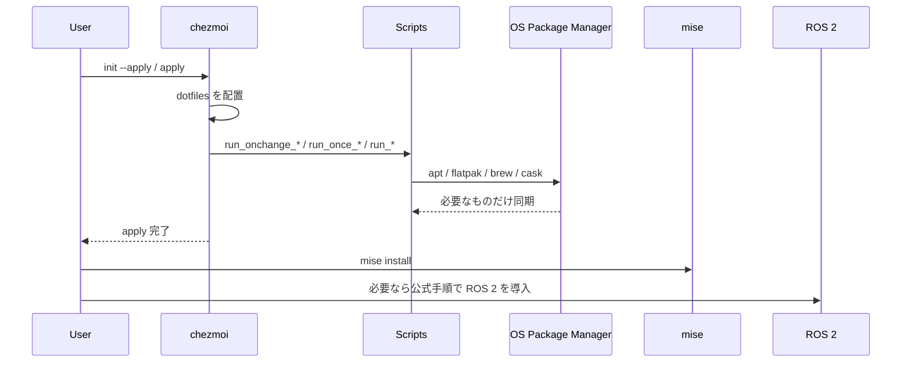

# chezmoi dotfiles

このリポジトリは、`Ubuntu` と `macOS` を対象にした `chezmoi` ベースの dotfiles 管理リポジトリです。

- 正式対応: `Ubuntu`, `macOS`
- Windows: 未対応
- ただし Windows 用資産は `assets/windows/` に置く
- 人間にも LLM agent にも読みやすい構造を維持する

設計の正本は [docs/architecture.md](docs/architecture.md) です。

OS ごとの補足:

- [docs/ubuntu.md](docs/ubuntu.md)
- [docs/macos.md](docs/macos.md)

## セットアップ

初回:

```bash
sh -c "$(curl -fsLS get.chezmoi.io)" -- init --apply <github-user-or-repo-url>
```

`chezmoi` がすでに入っている場合:

```bash
chezmoi init --apply <github-user-or-repo-url>
```

`chezmoi apply` 後に、ユーザー空間の runtime は明示的に入れます。

```bash
mise install
```

`mise` の missing command 自動 install は無効化しています。runtime 導入は常に明示実行です。

## 実行シーケンス



## 機能フラグ

マシンごとの任意機能は `~/.config/chezmoi/chezmoi.toml` で切り替えます。

```toml
[data.features]
ros2 = false
kicad = false
```

補足:

- `ros2` は Ubuntu 専用
- `kicad` は任意
- `ros2 = true` は ROS 関連設定を有効にするだけで、ROS 2 自体は install しない
- macOS 側は `brew` 導入済みを前提にしている

## 現在の状態

2026年3月13日時点:

- Ubuntu 側の v2 フローは再構成と実機検証が完了
- macOS 側は repo 内の構造はあるが、実機検証は未完了
