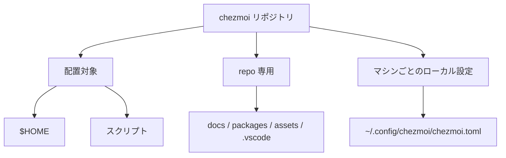
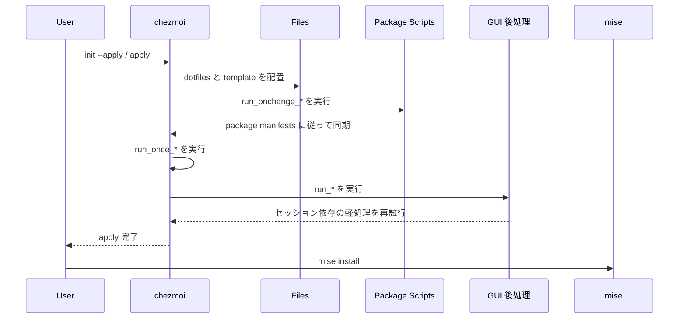
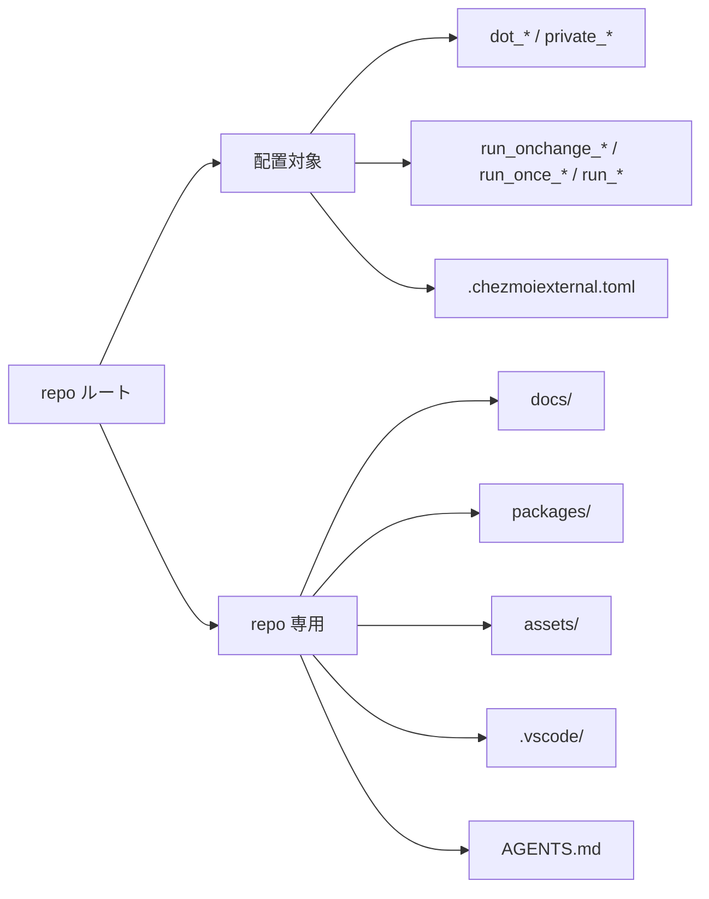

# chezmoi v2 設計

## 状態

この文書は、現在の v2 設計の正本です。

2026年3月14日時点の状態:

- Ubuntu はこの設計に沿って再構成済み
- Ubuntu では `chezmoi apply` による実機検証まで完了
- macOS は同じ設計で組んでおり、主要な `brew` / `cask` / shell 初期化フローの実機検証を進めている

## 目的

- `chezmoi` の責務を明確にする
- `Ubuntu` と `macOS` を無理に同一化しない
- repo 専用ファイルを `$HOME` に漏らさない
- 任意機能を機械ごとの明示設定で切り替える
- 数年後でも人間と LLM agent が同じ理解で保守できる状態を保つ

## 対象

- `Ubuntu`: 主対象
- `macOS`: 対応対象
- `Windows`: 未対応

Windows 用ファイルは Git 管理してよいですが、`chezmoi` が `$HOME` に配置してはいけません。

## 非目標

- Windows の完全自動構築
- repo 独自 bootstrap script を正規入口にすること
- `chezmoi apply` 中にすべての開発用 runtime を自動導入すること
- feature を無効化した時に自動 uninstall すること
- hostname ベースの暗黙分岐

## 全体像



## 実行モデル

正規入口は `chezmoi` の公式フローです。

新規マシン:

```bash
sh -c "$(curl -fsLS get.chezmoi.io)" -- init --apply <github-user-or-repo-url>
```

`chezmoi` 導入済み:

```bash
chezmoi init --apply <github-user-or-repo-url>
```

repo 固有の bootstrap script は通常不要です。

## 実行順



## 責務分離

### `chezmoi`

`chezmoi` の責務:

- dotfiles を `$HOME` に配置する
- local data を使って template を render する
- 軽量な script を実行する
- manifest 駆動の package 同期を起動する

`chezmoi` の責務ではないもの:

- 完全な構成管理ツールの代替
- OS 差分を隠すための過剰な抽象化
- すべての runtime の自動導入

### OS package manager

OS レベルの package は OS ごとの `run_onchange_*` script で扱います。

- Ubuntu: `apt`, `flatpak`
- macOS: `brew`, `cask`

これらの script は manifest と機能フラグから render され、必要なものだけ install します。manifest が満たされている時は不要な `apt-get update` や install を行いません。

### `mise`

`mise` はユーザー空間の runtime manager です。

- 設定ファイルは `chezmoi` が配置する
- `mise install` は手動実行
- `run_once_*` / `run_onchange_*` からは呼ばない
- shell 実行時の auto-install は無効化する

理由:

- network 依存で失敗点が増える
- `run_once_*` は将来の tool 追加に弱い
- shell/PATH 問題を切り分けやすくするため

### `cargo`

`cargo install` は標準の apply flow に含めません。

- `mise` や OS package manager で扱いにくいものだけ対象にする
- 必要なら手動、または明示 opt-in にする

## Script 方針

### `run_onchange_*`

用途:

- manifest 駆動の再実行可能な同期

例:

- Ubuntu の core `apt`
- Ubuntu の任意 `flatpak`
- macOS の `brew`
- macOS の `cask`

ルール:

- render 結果が変われば再実行される
- script 本文は package manifest と機能フラグから生成する
- manifest がすでに満たされていれば network refresh や install をスキップする
- macOS `cask` は Homebrew 管理外の既存 artifact と衝突しそうな場合、install を強行せず警告付きで skip する

### `run_once_*`

用途:

- 本当に一回でよい軽処理

例:

- `chsh`

ここに入れてはいけないもの:

- package 同期
- `mise install`
- `cargo install`
- moving target を取る大きな download

### `run_*`

用途:

- セッション状態に依存する軽い後処理

例:

- GNOME extension の有効化
- GUI セッション不在で失敗した軽処理の再試行

補足:

- plain `run_*` は `chezmoi status` で `R` と表示されるのが通常挙動です
- これは「次回 `chezmoi apply` で実行される」の意味で、repo の汚れではありません

## 機能フラグ

任意機能は branch や hostname ではなく、各マシンのローカル設定で制御します。

local file:

`~/.config/chezmoi/chezmoi.toml`

```toml
[data.features]
ros2 = false
kicad = false
```

ロボット用途の Ubuntu マシン例:

```toml
[data.features]
ros2 = true
kicad = true
```

意味:

- `ros2`: Ubuntu 専用
- `kicad`: 任意

feature を false にしても、自動 uninstall はしません。止まるのは「今後その manifest から install しない」ことだけです。

`ros2` だけは repo 側に機能フラグを持ちつつ、install 自体は公式 ROS 2 手順に従います。

## リポジトリ境界

配置対象:

- `dot_*`
- `private_*`
- `run_onchange_*`
- `run_once_*`
- `run_*`
- `.chezmoiexternal.toml`

repo 専用:

- `docs/`
- `packages/`
- `assets/`
- `.vscode/`
- `AGENTS.md`
- `.serena/` のような一時的 local state

これらの repo 専用 path は `.chezmoiignore.tmpl` で除外します。

## 目標ディレクトリ構造



```text
.
├── .chezmoiexternal.toml
├── .chezmoiignore.tmpl
├── dot_zprofile
├── dot_zshrc.tmpl
├── dot_mise.toml
├── private_dot_config/
├── private_dot_local/
├── run_onchange_10_ubuntu_apt.sh.tmpl
├── run_onchange_20_ubuntu_gui.sh.tmpl
├── run_onchange_30_ubuntu_input.sh.tmpl
├── run_40_ubuntu_gnome_input.sh.tmpl
├── run_onchange_10_macos_brew.sh.tmpl
├── run_onchange_20_macos_cask.sh.tmpl
├── run_once_10_shell.sh.tmpl
├── packages/
│   ├── ubuntu/
│   ├── macos/
│   └── common/
├── assets/
│   └── windows/
└── docs/
```

## Package 配置ルール

- `core.txt`: その OS / package manager で常に入れるもの
- feature file: 任意機能だけ
- package file は plain text、1 行 1 package、コメント可

## Package 振る舞い

### Ubuntu

- `apt/core.txt`: CLI / system 基本パッケージ
- `apt/gui.txt`: `flatpak` など GUI 基盤
- `apt/input.txt`: `fcitx5` など入力系
- `apt_thirdparty/core.txt`: `tailscale`, `code` など
- `flatpak/core.txt`: 任意の GUI app
- `flatpak/kicad.txt`: `features.kicad = true` の時だけ有効
- `run_onchange_30_ubuntu_input.sh.tmpl`: Toshy と入力系 package を処理
- `run_40_ubuntu_gnome_input.sh.tmpl`: GNOME session 中に xremap extension を有効化
- ROS 2 は手動で公式手順に従う

### macOS

- `brew/core.txt`: CLI / system パッケージ
- `cask/core.txt`: GUI アプリ
- `cask/kicad.txt`: `features.kicad = true` の時だけ有効

## Windows 資産

Windows 用資産は `assets/windows/` に置きます。

例:

- `assets/windows/solidworks/swSettings.sldreg`

これらは Git 管理してよいですが、Windows 対応を正式に設計するまでは配置しません。

## 保守ルール

- この文書を設計の一次情報にする
- `README.md` は短く保ち、この文書へ誘導する
- root に新しい file を置く前に、配置対象か repo 専用かを決める
- repo 専用なら `.chezmoiignore.tmpl` に反映する
- 暗黙分岐より機能フラグを優先する
- script の責務は filename から読める粒度にする
