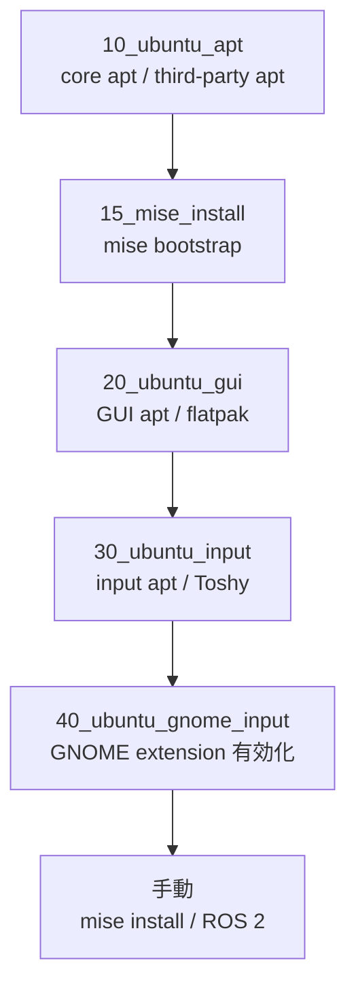
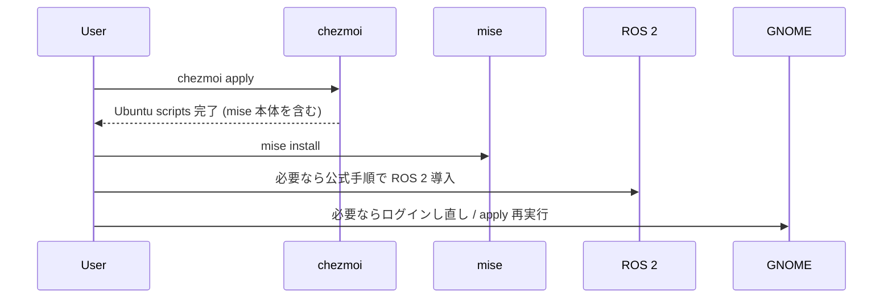

# Ubuntu メモ

この文書は Ubuntu 向けの v2 運用メモです。

2026年3月13日に Ubuntu 実機で検証済みです。

## 前提

- 対象 distro: Ubuntu 24.04 (`noble`)
- desktop environment: GNOME
- shell: `zsh`
- 入力系: `fcitx5` + `mozc` + `Toshy` + `xremap` GNOME extension

## Ubuntu レイヤ



### 1. Core apt

管理対象:

- [run_onchange_10_ubuntu_apt.sh.tmpl](../run_onchange_10_ubuntu_apt.sh.tmpl)
- [packages/ubuntu/apt/core.txt](../packages/ubuntu/apt/core.txt)
- [packages/ubuntu/apt_thirdparty/core.txt](../packages/ubuntu/apt_thirdparty/core.txt)

役割:

- どの Ubuntu マシンにも必要な CLI / system package を揃える
- `tailscale` や `code` のような third-party package を扱う

補足:

- manifest が満たされていれば `apt-get update` をスキップする
- third-party package は repo 追加済みであることを前提にする

### 2. `mise` bootstrap

管理対象:

- [run_onchange_15_mise_install.sh.tmpl](../run_onchange_15_mise_install.sh.tmpl)

役割:

- `mise` 本体を `~/.local/bin/mise` に bootstrap する
- 既存の `mise` があれば共有 installer で上書き更新する

補足:

- `mise install` は引き続き手動実行
- `git-delta` は apt ではなく [dot_mise.toml](../dot_mise.toml) の `github:dandavison/delta` として `mise install` で入れる
- `dot_zprofile` が `~/.local/bin` を `PATH` に入れる

### 3. GUI apt と flatpak

管理対象:

- [run_onchange_20_ubuntu_gui.sh.tmpl](../run_onchange_20_ubuntu_gui.sh.tmpl)
- [packages/ubuntu/apt/gui.txt](../packages/ubuntu/apt/gui.txt)
- [packages/ubuntu/flatpak/core.txt](../packages/ubuntu/flatpak/core.txt)
- [packages/ubuntu/flatpak/kicad.txt](../packages/ubuntu/flatpak/kicad.txt)

役割:

- `flatpak` など GUI 基盤を揃える
- `features.kicad = true` の時だけ KiCad を入れる

補足:

- apt と flatpak の両方が満たされていれば、update / install をスキップする

### 4. Input stack

管理対象:

- [run_onchange_30_ubuntu_input.sh.tmpl](../run_onchange_30_ubuntu_input.sh.tmpl)
- [run_40_ubuntu_gnome_input.sh.tmpl](../run_40_ubuntu_gnome_input.sh.tmpl)
- [packages/ubuntu/apt/input.txt](../packages/ubuntu/apt/input.txt)

役割:

- `fcitx5`
- `fcitx5-mozc`
- `fcitx5-config-qt`
- Toshy の install / 状態管理
- xremap GNOME extension の有効化

補足:

- input package が入っていれば `apt-get update` をスキップする
- Toshy は `TOSHY_REF` を見て状態を管理する
- 既存 install が desired ref を満たしていれば再 install しない
- GNOME extension の有効化は `run_*` に分け、GUI セッションがある時に再試行できるようにしている

## 配置される設定ファイル

- [dot_xinputrc](../dot_xinputrc)
- [private_profile](../private_dot_config/private_fcitx5/private_profile)
- [private_config](../private_dot_config/private_fcitx5/private_config)
- [org.fcitx.Fcitx5.desktop](../private_dot_config/autostart/org.fcitx.Fcitx5.desktop)
- [toshy_config.py](../private_dot_config/toshy/toshy_config.py)
- [extension.js](../private_dot_local/private_share/gnome-shell/extensions/xremap@k0kubun.com/extension.js)

## Feature Flags

マシンローカルな機能フラグ:

`~/.config/chezmoi/chezmoi.toml`

```toml
[data.features]
ros2 = false
kicad = false
```

### `kicad`

- Ubuntu 任意
- `true` の時、[packages/ubuntu/flatpak/kicad.txt](../packages/ubuntu/flatpak/kicad.txt) から KiCad を入れる

### `ros2`

- Ubuntu 任意
- 通常の `run_onchange` manifest では install しない
- 生成される shell config で ROS-aware な挙動を有効にする
- ROS 2 の install 自体は公式手順に従う

公式ドキュメント:

- ROS 2 Jazzy overview: https://docs.ros.org/en/jazzy/Installation.html
- Ubuntu deb install: https://docs.ros.org/en/jazzy/Installation/Ubuntu-Install-Debs.html

推奨パッケージ:

- `ros-jazzy-desktop`
- `ros-jazzy-ros-base`

重要:

- `features.ros2 = true` だけでは ROS 2 は install されない
- `/opt/ros/*/setup.zsh` が存在する時だけ shell 側で有効化される

## Third-party package

管理対象:

- [packages/ubuntu/apt_thirdparty/core.txt](../packages/ubuntu/apt_thirdparty/core.txt)

現在の対象:

- `tailscale`
- `code`
- `gh`

公式導入ページ:

- Tailscale: https://tailscale.com/docs/install/linux
- VS Code: https://code.visualstudio.com/download
- GitHub CLI: https://github.com/cli/cli/blob/trunk/docs/install_linux.md
- Zed: https://zed.dev/docs/installation

Zed は今のところ Ubuntu では手動後処理扱いです。

## apply 後の手動手順



手順:

1. login shell が変わった場合はログアウトして入り直す
2. `mise install` を実行する
   `mise` コマンド自体は `chezmoi apply` で入るので、ここでは runtime だけを揃える
3. `features.ros2 = true` の場合は公式 ROS 2 手順を実行する
4. xremap extension が有効になっていなければ、GNOME セッションを再起動して `chezmoi apply` を再実行する

## 確認項目

基本確認:

- `echo "$SHELL"`
- `command -v mise`
- `command -v fcitx5`
- `test -f ~/.config/toshy/toshy_config.py`
- `gsettings get org.gnome.shell enabled-extensions`

任意確認:

- `flatpak list | grep org.kicad.KiCad`
- `ros2 --help`
