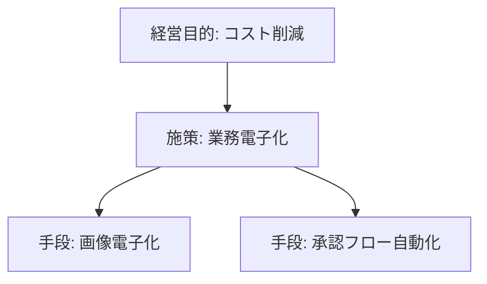
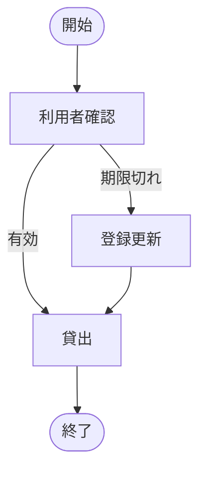
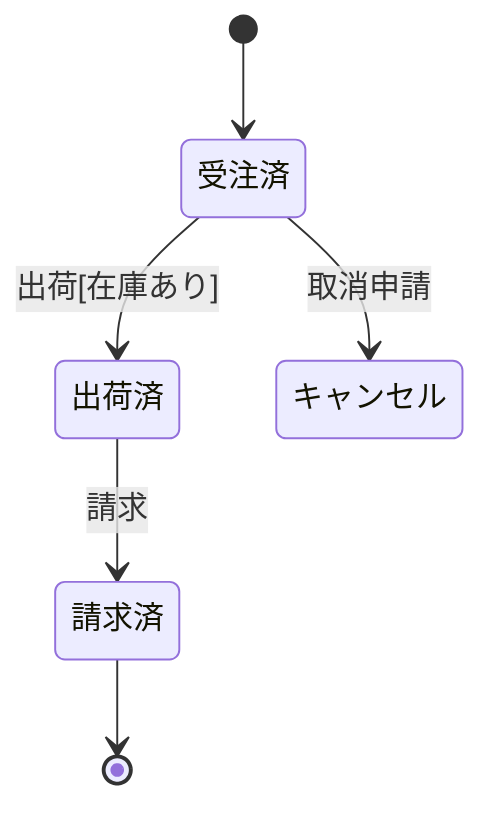
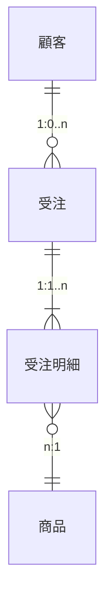

# 要件定義 成果物テンプレ集（DD）

AI が markdown / 表 / mermaid で出力する成果物のテンプレ。何を書くかは
`requirements-business`（要求）・`requirements-system`（仕様）・`requirements-verify`（点検）が決める。
ここは**形**を提供する。全部作る必要はない。**目的に必要な分だけ**テーラリングする。

---

## DD番号 → 成果物名（単一ソース。他スキルはここを参照）

| DD | 成果物（主なもの） |
|---|---|
| DD.1 | ビジネスコンセプト（SWOT/BSC/ビジネスモデルキャンバス） |
| DD.2 | ステークホルダ（2.1関連図 / 2.2一覧 / 2.3リッチピクチャ） |
| DD.3 | 要求分析（3.1問題ニーズ課題一覧 / 3.2問題原因分析図 / 3.3要求構造図 / 3.4要求一覧） |
| DD.4 | データモデル（4.1管理対象分類図 / 4.2概念ER図） |
| DD.5 | ビジネスプロセス（5.3業務フロー / 5.4システム化業務フロー / 5.5業務処理定義） |
| DD.6 | 相互作用（6.1状態遷移図） |
| DD.7 | コミュニケーション（**7.1業務用語定義** / **7.2 Before/After図**） |
| DD.8 | 各種一覧（業務/画面/帳票/外部IF/エンティティ） |
| DD.9 | インターフェース（9.1システム化要求仕様 / 9.2 UI標準 / 9.3画面遷移図 / 9.4レイアウト） |
| DD.10 | データ定義（10.1エンティティ定義 / 10.2ドメイン / 10.3コード体系） |
| DD.11 | 機能・データ整合性（11.1 CRUD図） |
| DD.12 | 非機能要求（12.1非機能要件書） |
| DD.13 | 運用・移行・総合テスト（13.1運用 / 13.2移行 / 13.3総合テスト） |

---

## 規模別の出力セット（過剰適用しない）

- **小規模ミニセット（Light）**: ①ミニ要求一覧（要求ID・内容・優先度・採否）＋ 実装準備ブリーフ
  （受入条件・対象外・影響範囲）。下の「標準5つ」フルは不要。
- **標準セット（中規模以上）**: 下の①〜⑤を順に揃えると骨格になる。
- **拡張セット（大規模/再構築）**: 標準＋拡張セット＋各種一覧。

## 標準出力セット（中規模以上：この5つ）

### ① 要求一覧（DD.3.4）★最重要ベースライン
全要求の構造化・採否・優先度・ゴール紐付けを一元管理。
```markdown
| 要求ID | 種別 | 内容 | 測定尺度 | 現状値 | 目標値 | 優先度(MoSCoW) | 採否 | 紐付くゴール | 担当 |
|--------|------|------|---------|--------|--------|---------------|------|-----------|------|
| A01 | 経営目的 | オペコスト削減 | 事務コスト | 100% | -10% | Must | 採 | G1 | 経営企画 |
| D01 | 実現手段 | 画像電子化 | 撮影業務時間 | 80h/日 | 60h/日 | Must | 採 | G1 | IT部 |
```

### ② 問題・ニーズ・課題一覧（DD.3.1）
要求の発生源。後で要求一覧と突合して漏れを防ぐ。問題（事実）／ニーズ（要望）／課題（テーマ）を分ける。
```markdown
| No | テーマ | 分類 | 提起者 | 問題(事実) | 影響 | 原因 | ニーズ(要望) | 課題(解決テーマ) |
|----|--------|------|--------|-----------|------|------|------------|----------------|
| 001 | 在庫 | コスト | 営業X | 過剰在庫4億/年 | 倉庫費増 | 担当者判断の積み増し | 適正在庫 | 販売連動型在庫管理 |
```

### ③ ステークホルダ一覧（DD.2.2）
SH特定なしに要求抽出は始まらない。影響度・対立も記録。
```markdown
| No | 組織 | 氏名/役職 | 役割(実行/意思決定/相談/報告) | 承認権限 | 影響度 | 関心度 | 対応方針 |
|----|------|----------|------------------------------|---------|--------|--------|---------|
| 001 | 物流部 | 中村/部長 | 意思決定 | 予算・要求承認 | 大 | 大 | 重点管理 |
```

### ④ 非機能要件書（DD.12.1）
コスト影響大。数値化必須（IPA非機能要求グレード/ISO 25010）。
```markdown
### 可用性
| 項目 | 要求値 | 根拠 |
|------|--------|------|
| 稼働率 | 99.9%以上 | 月停止30秒以内 |
| RTO | 2時間以内 | 業務影響大 |
| RPO | 障害発生時点 | データ損失不可 |
### 性能・拡張性
| 項目 | 要求値 |
|------|--------|
| 画面レスポンス(通常) | 3秒以内 |
| 同時接続ユーザ数 | 最大500人 |
```

### ⑤ CRUD図（DD.11.1）
機能×データの整合性を最小コストで網羅検証。Cなしに R/U/D は機能漏れ。
```markdown
| エンティティ\業務 | 受注登録 | 受注照会 | 受注変更 | 出荷処理 | 請求処理 |
|----------------|---------|---------|---------|---------|---------|
| 受注 | C | R | U | R | R |
| 在庫 | R | R | - | U | - |
| 請求 | - | - | - | C | U |
```

---

## 拡張セット（規模・フェーズに応じて）

### 要求構造図（目的手段ツリー, DD.3.3）— mermaid


### 業務フロー / システム化業務フロー（DD.5.3/5.4）— mermaid


### 状態遷移図（DD.6.1）— mermaid（主要エンティティのライフサイクル）


### システム化要求仕様（DD.9.1）— シナリオ表
```markdown
**業務**: ユーザ情報変更　**事前条件**: 管理者ログイン済　**事後条件**: 情報が変更される
| ステップ | 利用者のアクション | システムのアクション |
|---------|-----------------|------------------|
| 1 | 一覧を要求 | 一覧を返す |
| 2 | 対象を選び詳細要求 | 詳細を返す |
| 3 | 変更を要求 | 情報を変更する |
**例外**: 対象不在 → エラー応答
```

### 各種一覧（DD.8）— 例: 外部インターフェース一覧
```markdown
| No | IF-ID | IF名称 | 送受信 | 相手システム | 新旧 | 接続方式 | タイミング |
|----|-------|--------|--------|------------|------|---------|-----------|
| 1 | IF-001 | 受注連携 | 送信 | 販売管理 | 新規 | FTP/XML | 日次バッチ |
```
（同形式で システム化業務一覧/画面一覧/帳票一覧/エンティティ一覧 を作る）

### 業務用語定義（DD.7.1）
```markdown
| No | 用語 | 読み | 説明 | 同義語(禁止) | カテゴリ |
|----|------|------|------|-------------|---------|
| 1 | 顧客 | こきゃく | 売買取引を行う企業・個人 | - | マスタ |
```

### 概念ER図（DD.4.2）— mermaid


---

## 管理台帳（requirements-verify と対）

### トレーサビリティマトリクス
```markdown
| BR-ID | BR要求 | SR-ID | SR要件 | 実装 | テスト | 状態 |
|-------|--------|-------|--------|------|--------|------|
| BR-01 | 在庫把握 | SR-03 | 在庫照会API | inventory.ts | T-12 | ✅ |
```

### 未決事項台帳
```markdown
| No | 未決内容 | 責任者 | 期限 | スコープ影響 | 後続影響 | 扱い(案) |
|----|---------|--------|------|------------|---------|---------|
| U1 | 予測精度基準 | 業務A | 6/30 | 中 | 設計遅延 | 期間延長 |
```

### 完了判断チェックシート（6項目。requirements-verify と同一）
```markdown
- [ ] [critical] 主要SHの合意（単独依頼者なら依頼者の確認をもって合意）
- [ ] [critical] 未カバー要求 0
- [ ] [critical] 孤立機能 0
- [ ] 非機能の数値化
- [ ] 未決の台帳化＋オーナー合意
- [ ] 検証・妥当性確認のレビュー記録あり
充足率: __ / 6
```

### 実装準備ブリーフ（Implementation Readiness Brief｜Light でも出す）
```markdown
## 実装準備ブリーフ: <機能名>
- 目的 / 紐付くゴール: 
- 対象 / 対象外: 
- 受入条件: 
- 影響範囲（画面/モジュール/データ・既存互換性・移行有無）: 
- 非機能影響（性能/可用性/セキュリティ・数値）: 
- 制約・前提（技術/既存資産/期日/法規）: 
- テスト観点 / ロールバック・リリース方針: 
- トレース（BR-ID / SR-ID）: 
```

### 制約・前提一覧（与件）
```markdown
| No | 区分(技術/法規/予算/期日/既存資産) | 内容 | 影響 | 出所 |
|----|-----------------------------------|------|------|------|
| 1 | 技術 | 既存DBはPostgreSQL固定 | スキーマ変更不可 | 情シス |
```

---

## AI には骨子のみ（割り切る）
リッチピクチャ・画面レイアウト(ピクセル精度)・全体移行計画（現行詳細が必要）は
テキスト骨子のみ。図/レイアウトは人間が仕上げる前提で項目リストを出す。

## 全テンプレ（DD.1–DD.13 詳細）
記載項目・勘どころの完全版は `references/dd-gallery.md` を参照。
