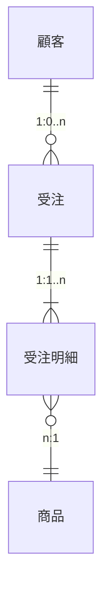
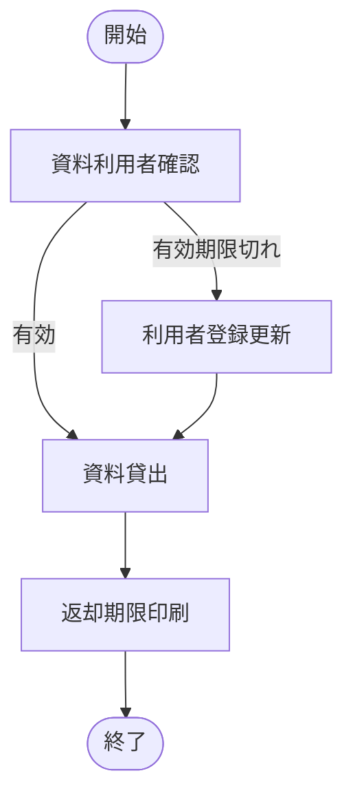
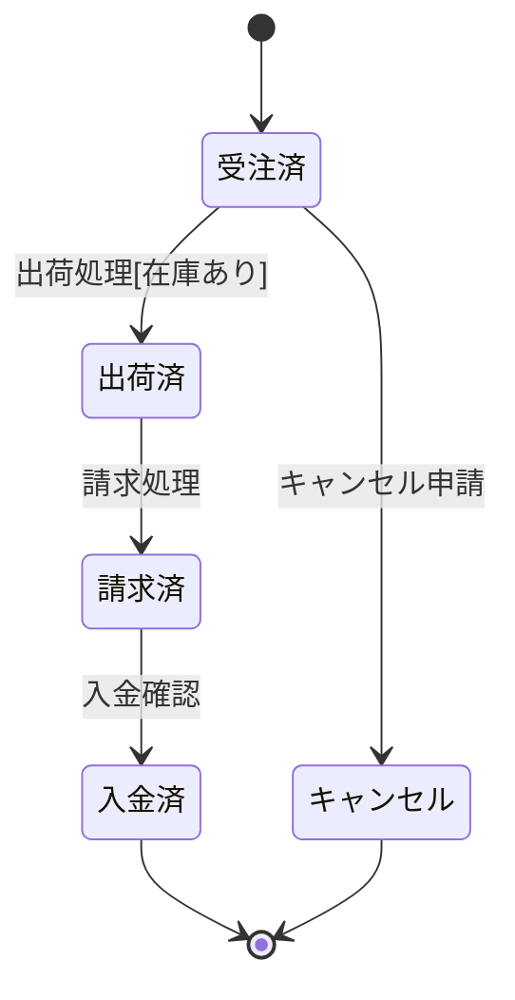

# 第7章 主要ドキュメント作成(DD) ダイジェスト

IPA「ユーザのための要件定義ガイド第2版」第7章より。36成果物を13カテゴリに分類。

---

### DD.1 ビジネスコンセプト（SWOT分析・BSC・ビジネスモデルキャンバス）

- **目的/いつ使うか**: 経営層の方向性を確認・合意する。既存ドキュメントで十分なら不要。
- **記載項目の要点**:
  - SWOT: 強み/弱み/機会/脅威の4象限
  - BSC: 財務・顧客・社内プロセス・学習成長の4視点 × KGI/CSF/KPI/目標値/アクション
  - ビジネスモデルキャンバス: 9ブロック（価値提案・顧客・チャネル・関係・収益・KP/KA/KR・コスト）
- **作成の勘どころ/品質チェック**: 要件定義開始時点で整理されていない場合のみ作成。構想立案が必要なら要件定義の工程外作業として別途確保。
- **AI実践での扱い**: AIが生成可能。markdownの表/箇条書きで十分。

最小フォーマット例（SWOT）:
```markdown
| 内部/外部 | プラス | マイナス |
|-----------|--------|---------|
| 内部 | S: 強み | W: 弱み |
| 外部 | O: 機会 | T: 脅威 |
```

---

### DD.2 ステークホルダ（ステークホルダ関連図・一覧・リッチピクチャ）

- **目的/いつ使うか**: SHの漏れをなくし、適切なアプローチで合意形成を進めるため。プロジェクト開始直後に作成。
- **記載項目の要点**:
  - 関連図: SH名・組織/役割・SH間関係
  - 一覧: No/プロフィール(組織・名前・役職)/承認権限/影響度/位置付け/重要度
  - リッチピクチャ: SH・思いや意見(吹き出し)・課題・依存関係（ビジュアル重視）
- **作成の勘どころ/品質チェック**: キーマン特定と参画可否まで確認。SH間の師弟関係・対立等の人間関係も記録。定期的に見直す。
- **AI実践での扱い**: SH一覧はAIがmarkdown表で生成可能。リッチピクチャは図必須のためAIは骨子（テキストによる関係メモ）のみ。

最小フォーマット例（SH一覧）:
```markdown
| No | 組織 | 氏名 | 役職 | 役割 | 承認権限 | 影響度 | 重要度 | 位置付け |
|----|------|------|------|------|---------|--------|--------|---------|
| 001 | 物流部 | 中村 | 部長 | 関東統括 | 予算・要求承認 | 大 | 大 | PO・意思決定 |
```

---

### DD.3 要求分析（問題ニーズ課題一覧・問題原因分析図・要求構造図・要求一覧）

**AIが最優先で生成すべきカテゴリ。**

- **目的/いつ使うか**: ニーズ・問題・課題を構造化し、要求と紐付けて抜け漏れを防ぐ。BR（ビジネス要求定義）フェーズ全体を通して作成・成長させる。
- **記載項目の要点**:
  - 問題ニーズ課題一覧(DD.3.1): No/問題抽出テーマ/分類/提起者/問題/影響/原因/ニーズ/課題
  - 問題原因分析図(DD.3.2): 問題・因果関係（影響系・原因系）・解決ポイント（なぜなぜ分析）
  - 要求構造図(DD.3.3): 経営目的→経営施策→業務目的→実現手段→システム機能の階層関係。AND/ORを明示
  - 要求一覧(DD.3.4): 要求ID/内容/各層属性（測定尺度・現状値・目標値・優先度・採否区分・担当部門）
- **作成の勘どころ/品質チェック**:
  - 問題と課題を混同しない（課題=解決すべきテーマ）
  - 「現行踏襲」は受け入れない
  - 採否区分で膨らみ要求を管理する
  - 後半で問題一覧と要求一覧を突合して漏れチェック
- **AI実践での扱い**: 全てAIがmarkdown/表で生成可能。**要求一覧は最重要成果物**。

最小フォーマット例（問題ニーズ課題一覧）:
```markdown
| No | テーマ | 分類 | 提起者 | 問題 | 影響 | 原因 | ニーズ | 課題 |
|----|--------|------|--------|------|------|------|--------|------|
| 001 | 在庫管理 | コスト | 営業部X氏 | 過剰在庫4億円/年 | 倉庫費拡大 | 担当者判断の在庫積み増し | 適正在庫実現 | 販売連動型在庫管理の実現 |
```

最小フォーマット例（要求一覧）:
```markdown
| 要求ID | 種別 | 内容 | 測定尺度 | 現状値 | 目標値 | 優先度 | 採否 | 担当 |
|--------|------|------|---------|--------|--------|--------|------|------|
| A01 | 経営目的 | オペコスト削減 | 医療事務コスト | 100% | -10% | 高 | 採 | 経営企画 |
| D01 | 実現手段 | 画像電子化(フィルムレス) | 撮影業務時間 | 80h/日 | 60h/日 | 高 | 採 | IT部 |
```

---

### DD.4 データモデル（管理対象分類図・概念データモデルER図）

- **目的/いつ使うか**: 業務を扱うデータ構造の側面から可視化。As-IsとTo-Beの両方を作成して課題発見・新業務合意に使う。
- **記載項目の要点**:
  - 管理対象分類図(DD.4.1): 管理対象名・識別子・分類観点・補足コメント（MECE分類、禁止用語明示）
  - 概念ER図(DD.4.2): エンティティ名・識別子・属性・リレーション名・カージナリティ・オプショナリティ・分類観点
- **作成の勘どころ/品質チェック**:
  - 事実に忠実に描く（過去経験で「こうあるはず」で描かない）
  - 具体的なデータ値を入れて検証する
  - 要件定義段階では全エンティティ・主要データ項目まで。全データ項目はSyRS段階で
- **AI実践での扱い**: 管理対象分類図はmarkdownで記述可能。ER図は図が中心だが**Mermaidで骨子生成可能**。

最小フォーマット例（mermaid ER骨子）:


---

### DD.5 ビジネスプロセスモデル（関連図・業務機能構成表・業務フロー・システム化業務フロー・業務処理定義書）

**AIが生成可能な成果物が多いカテゴリ。**

- **目的/いつ使うか**: 業務の流れ・機能・処理を3階層（関連図→業務フロー→システム化業務フロー）で可視化。To-Beの合意形成に中心的役割。
- **記載項目の要点**:
  - 関連図(DD.5.1): スコープ・ビジネスプロセス（1〜2階層）・処理の流れ・情報の流れ・外部連携（1枚に収める）
  - 業務機能構成表(DD.5.2): BP1/BP2/作業/システム利用作業/業務機能概要/利用者（3階層のWBS的一覧）
  - 業務フロー(DD.5.3): プロセス（2階層中心）・情報の流れ・順序・合流/分岐（5W2Hで確認）
  - システム化業務フロー(DD.5.4): 作業・システム利用作業・システム機能・UI（画面/帳票）・業務データ
  - 業務処理定義(DD.5.5): 概要・業務処理説明・業務ルール・例外業務（USDM形式推奨）
- **作成の勘どころ/品質チェック**:
  - 3種のフロー図を階層化し粒度を統一
  - 通常処理だけでなく例外処理・特殊処理の抽出が品質に直結
  - システム化業務フローでシステム利用作業とシステム機能が1:1対応するように描く
  - 「現行踏襲」は明確な仕様に展開すること
- **AI実践での扱い**: 業務フロー・システム化業務フローは**Mermaidのflowchartで骨子生成可能**。業務機能構成表・業務処理定義はmarkdown表で生成可能。

最小フォーマット例（業務フロー mermaid）:


---

### DD.6 相互作用モデル（状態遷移図）

- **目的/いつ使うか**: エンティティのライフサイクルを明確化し、業務プロセスとの整合性を確認。業務ルールが複雑なエンティティに対して作成。
- **記載項目の要点**:
  - 開始/終了・状態・遷移（矢印）・分岐（条件）
  - 各イベントがどのシステム化業務フローと対応するかを確認
- **作成の勘どころ/品質チェック**:
  - 状態を変化させるイベントを全て洗い出す
  - 他エンティティとの同期遷移を確認
  - 推測した状態変化は点線で描きレビューで確認
- **AI実践での扱い**: **Mermaidのstatediagramで完全生成可能**。

最小フォーマット例:


---

### DD.7 コミュニケーション（業務用語定義・ビフォーアフター図）

- **目的/いつ使うか**: プロジェクト内での用語齟齬防止と、経営層への変革内容説明のため。プロジェクト開始早期から用語定義を積み上げる。
- **記載項目の要点**:
  - 業務用語定義(DD.7.1): No/利用可否/業務用語/読み仮名/説明/異音同義語/同音異義語/略語/カテゴリ
  - ビフォーアフター図(DD.7.2): 狙い・現状業務と問題点・新規業務・予測効果（定量/定性）・前提条件
- **作成の勘どころ/品質チェック**:
  - 異音同義語（企業=法人顧客）と同音異義語（サービス商品の意味の違い）を排除
  - 略語の正式名称を定義
  - ビフォーアフター図は定量効果を必ず記載（「30%削減」等）
- **AI実践での扱い**: 業務用語定義・ビフォーアフター図ともにmarkdown/表で生成可能。

最小フォーマット例（業務用語定義）:
```markdown
| No | 用語 | 読み | 説明 | 同義語(禁止) | 異義語 | カテゴリ |
|----|------|------|------|-------------|--------|---------|
| 1 | 顧客 | こきゃく | 売買取引を行う企業・個人の総称 | - | - | マスタ |
| 2 | 仕入先 | しいれさき | 顧客のうち買い取引を行う企業・個人 | - | - | マスタ |
```

---

### DD.8 各種一覧（システム化業務一覧・画面一覧・帳票一覧・外部IF一覧・エンティティ一覧）

**AIが完全生成可能。要求の網羅性を担保する重要成果物。**

- **目的/いつ使うか**: システム化要求の抜け漏れ防止と規模見積もりのため。SR（システム化要求定義）フェーズで作成。
- **記載項目の要点**:
  - システム化業務一覧(DD.8.1): ID/システム化業務名/概要/分類(バッチ/オンライン)/利用者/備考
  - 画面一覧(DD.8.2): No/画面名/画面ID/分類/階層/説明(利用者・目的・頻度)/機能名/機能ID
  - 帳票一覧(DD.8.3): 帳票ID/名称/出力タイミング/出力様式/用紙サイズ/利用業務/作成方法
  - 外部IF一覧(DD.8.4): IF-ID/名称/出力or入力/相手先システム/既存or新規/接続方式/処理タイミング
  - エンティティ一覧(DD.8.5): エンティティ名/種別(イベント系/リソース系/サマリ系)/定義/保存期間/抽出元
- **作成の勘どころ/品質チェック**:
  - 業務フローと突合してシステム化業務の抜け漏れを確認
  - 画面一覧はツリー形式で重複・抜けを防止
  - 外部IFはスコープ外との境界で必ず洗い出す
- **AI実践での扱い**: 全てAIがmarkdown表で完全生成可能。**機能規模の初期見積もりにも直結。**

最小フォーマット例（外部IF一覧）:
```markdown
| No | IF-ID | IF名称 | 送受信 | 相手システム | 新旧 | 接続方式 | タイミング |
|----|-------|--------|--------|------------|------|---------|-----------|
| 1 | IF-001 | 受注情報連携 | 送信(To) | 販売管理システム | 新規 | FTP/XML | バッチ(日次) |
| 2 | IF-002 | 与信照会 | 受信(From) | クレジット照会(外部) | 既存 | HTTPS | オンライン(随時) |
```

---

### DD.9 インターフェース（システム化要求仕様・UI標準・画面遷移図・画面/帳票レイアウト）

- **目的/いつ使うか**: アクターとシステムの相互作用を明確化し、ビジネス要求が実現できるかを業務部門と確認。SR段階。
- **記載項目の要点**:
  - システム化要求仕様(DD.9.1): 入力データ/出力データ/システム化業務の振る舞い（基本・代替・例外シナリオ）/事前条件/事後条件
  - UI標準(DD.9.2): ページ構成要素/配色/フォント/全体構造・ナビゲーション/画面遷移パターン/エラー表示方法/ユーザ定義/制約事項
  - 画面遷移図(DD.9.3): 画面・遷移矢線・アクション・イベント・条件分岐/合流・異常系
  - 画面/帳票レイアウト(DD.9.4,5): 画面ID/概要/レイアウト図/識別ID/ラベル/部品種類/操作手順
- **作成の勘どころ/品質チェック**:
  - まずUI標準を合意してから個別画面を定義
  - レイアウトは具体的なデータ例で表示（XXXではなく実データ）
  - 検討経緯を注釈として残す
  - 正常系だけでなく例外系の遷移を必ず記載
- **AI実践での扱い**: システム化要求仕様はmarkdownのシナリオ表で生成可能。UI標準は箇条書きで骨子生成可能。画面遷移図はMermaid(flowchart)で骨子生成可能。画面レイアウトはAIは骨子(項目リスト)のみ、実レイアウト図は別途。

最小フォーマット例（システム化要求仕様）:
```markdown
**システム化業務**: ユーザ情報変更
**事前条件**: 管理者権限でログイン済み
**事後条件**: ユーザ情報が変更されること

| ステップ | 利用者のアクション | システムのアクション |
|---------|-----------------|------------------|
| 1 | ユーザ一覧を要求 | ユーザ一覧を返す |
| 2 | 変更対象を選択し詳細要求 | 詳細情報を返す |
| 3 | 情報変更を要求 | 該当ユーザ情報を変更する |

**例外シナリオ**: 指定ユーザ不在 → エラーメッセージを返す
```

---

### DD.10 データ定義（エンティティ定義書/データ項目定義書・ドメイン定義書・コード体系定義書）

- **目的/いつ使うか**: データ項目の標準化と管理責任の明確化。ホモニム・シノニムを排除し設計工程への入力を整える。
- **記載項目の要点**:
  - エンティティ定義書(DD.10.1): 属性名/型/属性説明/長さ/精度/必須/主キー
  - ドメイン定義書(DD.10.2): ドメインID/コード/非コード区分/分類/ドメイン名/型/説明/記述形式/最小値/最大値/既定値
  - コード体系定義書(DD.10.3): ドメインID/ドメイン名/コード説明/構成/桁別内容・文字種別・桁数・値
- **作成の勘どころ/品質チェック**:
  - 「日」「YMD」「年月日」→1つに統一（命名規則化）
  - コードと数値を区別する（「期間月数」に0000=未定の例外を持たせない）
  - 1項目に複数意味を持たせない
  - データ管理部門（主管）を必ず決める
- **AI実践での扱い**: エンティティ定義書・ドメイン定義書ともにmarkdown表で生成可能。

最小フォーマット例（エンティティ定義書）:
```markdown
**エンティティ**: 受注

| No | 属性名 | 型 | 説明 | 桁数 | 必須 | PK |
|----|--------|-----|------|------|------|----|
| 1 | 受注番号 | 数値型 | 受注を一意に識別する番号 | 10 | Y | 1 |
| 2 | 受注日 | 日付型 | 受注が発生した年月日 | - | Y | - |
| 3 | 顧客コード(FK) | 数値型 | 顧客エンティティへの参照 | 10 | Y | - |
```

---

### DD.11 機能・データ整合性検証（CRUD図）

**AIが完全生成可能。機能とデータの網羅性・矛盾検証の要。**

- **目的/いつ使うか**: システム化業務とエンティティのCreate/Read/Update/Delete関係を可視化し、機能・データの抜け漏れ・矛盾を検証。要件定義後半の検証段階で作成。
- **記載項目の要点**:
  - 縦軸: エンティティ（または主要データ項目）
  - 横軸: システム化業務（またはビジネスプロセス）
  - セル: C/R/U/D（作成/参照/更新/削除）
- **作成の勘どころ/品質チェック**:
  - C（作成）なしにR/U/D がある場合は機能漏れ
  - C が後続機能で実行されるのに前の機能でRしている場合は矛盾
  - 要件定義段階では全データ×全機能でなくてよい。主要エンティティ×主要業務に絞る
  - 論理削除と物理削除を区別する
- **AI実践での扱い**: **AIがmarkdown表で完全生成可能**。最もコスパの高いAI適用成果物。

最小フォーマット例:
```markdown
| エンティティ\業務 | 受注登録 | 受注照会 | 受注変更 | 出荷処理 | 請求処理 |
|----------------|---------|---------|---------|---------|---------|
| 顧客 | R | R | R | R | R |
| 受注 | C | R | U | R | R |
| 受注明細 | C | R | U | R | R |
| 在庫 | R | R | - | U | - |
| 請求 | - | - | - | C | U |
```

---

### DD.12 非機能要求（非機能要件書）

**AIが生成可能。IPA非機能要求グレード2018に準拠して6領域238項目をカバー。**

- **目的/いつ使うか**: 可用性・性能・運用保守性・移行性・セキュリティ・環境エコロジーの6領域で要件を合意。コスト影響の大きい事項は必ず要件定義段階で確定。
- **記載項目の要点**:
  - 可用性: 運用時間/計画停止有無/稼働率/サービス切替時間/RPO/RTO/RLO/大規模災害時目標
  - 性能・拡張性: レスポンスタイム/同時接続数/データ量/ピーク処理量/拡張性
  - 運用・保守性: 運用スケジュール/バックアップ方針/障害対応体制/保守作業
  - 移行性: 移行方式/移行対象データ量/並行稼働期間
  - セキュリティ: 認証・認可/暗号化/ログ/不正アクセス対策
  - システム環境: HW構成/OS/MW/ネットワーク/エコロジー要件
- **作成の勘どころ/品質チェック**:
  - 「早いに越したことはない」という曖昧要求をメトリクス化する
  - セキュリティ強化と利便性のトレードオフに決着をつける
  - コスト影響の大きい項目（24時間無停止・DR要件等）は経営層と合意
- **AI実践での扱い**: AIがmarkdown/表で生成可能。IPA非機能要求グレードの項目体系をプロンプトに与えれば詳細なドラフトを生成できる。

最小フォーマット例:
```markdown
## 非機能要件書（抜粋）

### 可用性
| 項目 | 要求値 | 根拠 |
|------|--------|------|
| 運用時間（通常） | 9:00〜21:00（夜間のみ停止、レベル2） | 夜間バッチ運用あり |
| 稼働率 | 99.9%以上 | 月30秒以内の停止 |
| RTO（目標復旧時間） | 2時間以内 | 業務影響大 |
| RPO（目標復旧地点） | 障害発生時点 | データ損失不可 |

### 性能・拡張性
| 項目 | 要求値 |
|------|--------|
| 画面レスポンス（通常） | 3秒以内 |
| 同時接続ユーザ数 | 最大500人 |
```

---

### DD.13 運用・移行・総合テスト（運用要件書・全体移行計画書・総合テスト計画書）

- **目的/いつ使うか**: システム稼働後の安定運用・移行・品質確保の要件を要件定義段階から計画。後回しにすると設計への手戻り大。
- **記載項目の要点**:
  - 運用要件書(DD.13.1): 運用範囲/SLO/運用体制/運用・保守作業/ITサービス管理方針
  - 全体移行計画書(DD.13.2): 移行範囲/移行方式(一斉/スモールスタート/並行稼働)/スケジュール/データクレンジング方針/切り戻し方針/教育訓練方針
  - 総合テスト計画書(DD.13.3): テスト目的・対象・範囲/前提条件/環境/期間/シナリオ（正常系・例外系・特殊系）/完了基準
- **作成の勘どころ/品質チェック**:
  - 移行計画: データクレンジングの責任者を明確化。移行テスト・リハーサルを計画に入れる
  - 総合テスト: 要件定義最後に作成義務付けると要求漏れを発見できる（Wモデル）
  - 並行稼働の有無・切り戻し手順は早期決定が必須
- **AI実践での扱い**: 運用要件書・総合テスト計画書の骨子はAIがmarkdownで生成可能。移行計画は詳細な現行システム情報が必要なため骨子のみ。

最小フォーマット例（総合テスト計画骨子）:
```markdown
## 総合テスト計画書（骨子）

### 目的・完了基準
- 目的: 一連の業務フロー（正常系・例外系）がシステム通じて正しく実行できることを確認
- 完了基準: 重大障害0件、軽微障害95%以上解消

### テストシナリオ構成
| シナリオID | 業務名 | 種別 | 優先度 |
|-----------|--------|------|--------|
| TS-001 | 受注→出荷→請求の一連処理 | 正常系 | 高 |
| TS-002 | 在庫不足時のバックオーダー処理 | 例外系 | 高 |
| TS-003 | 月末締め処理 | 特殊系 | 中 |
```

---

## AI要件定義スキルが標準で出力すべき成果物セット（優先順）

以下をAIエージェントが自動生成する「標準出力セット」として定義する。

| 優先 | 成果物 | カテゴリ | 形式 | 根拠 |
|------|--------|---------|------|------|
| 1 | **要求一覧**（DD.3.4） | DD.3 | markdown表 | 全要求の構造化・採否管理。最重要ベースライン |
| 2 | **問題ニーズ課題一覧**（DD.3.1） | DD.3 | markdown表 | 要求の発生源。問題と要求の照合で漏れ防止 |
| 3 | **ステークホルダ一覧**（DD.2.2） | DD.2 | markdown表 | SH特定なしに要求抽出できない |
| 4 | **非機能要件書**（DD.12.1） | DD.12 | markdown表 | コスト影響大。後回しは設計手戻りを招く |
| 5 | **CRUD図**（DD.11.1） | DD.11 | markdown表 | 機能×データの整合性を最小コストで検証 |

### 拡張セット（プロジェクト規模・フェーズに応じて追加）

| 優先 | 成果物 | 形式 |
|------|--------|------|
| 6 | システム化業務一覧（DD.8.1） | markdown表 |
| 7 | 外部インターフェース一覧（DD.8.4） | markdown表 |
| 8 | 業務フロー（DD.5.3） | mermaid flowchart |
| 9 | 状態遷移図（DD.6.1）主要エンティティ対象 | mermaid statediagram |
| 10 | システム化要求仕様（DD.9.1）主要業務対象 | markdown シナリオ表 |
| 11 | 業務用語定義（DD.7.1） | markdown表 |
| 12 | エンティティ一覧（DD.8.5）+ 概念ER図（DD.4.2）骨子 | markdown表 + mermaid ER |

### AIには生成が困難（骨子のみ）

- リッチピクチャ（DD.2.3）: ビジュアル図が主体
- ビジネスプロセス関連図（DD.5.1）: 全体スコープ図（骨子はmermaidで可）
- 画面レイアウト（DD.9.4）: ピクセル精度のレイアウト
- 全体移行計画書（DD.13.2）: 現行システム詳細情報が必要
